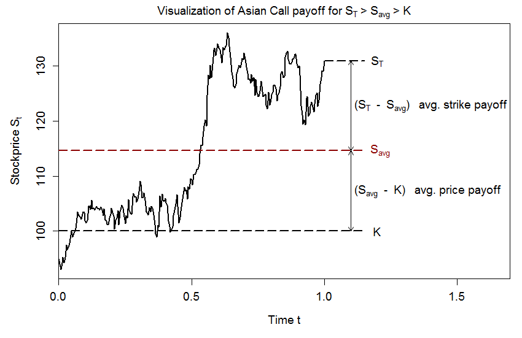

[](http://quantlet.de/)

## [](http://quantlet.de/) **SFEAsianCallPayoffVis** [](http://quantlet.de/)

```yaml


Name of Quantlet: SFEAsianCallPayoffVis

Published in:     Statistics of Financial Markets I

Description:     'Visualizes the payoff of an Asian average strike and average 
                  price call option for a generated stock path with average price 
                  between price at maturity and strike price.' 

Keywords:         plot, visualization, exotic-option, option, call

Author:           Stefan Ritschel

See also:         SFEMCAsian, SFEMCAsianCallVsEuropCall

Submitted:        2016/12/16


Input: 
- s.0:   current stock price
- k:     strike price
- tau:   time to maturity in years
- n.t:   number of time steps (used for stock simulation and averaging)
- r:     annual interest rate
- sigma: volatility


```



### R Code
```r

# clear variables and close windows
rm(list = ls(all = TRUE))
graphics.off()

# settings
s.0   = 35     # current stock price
k     = 40     # strike price
tau   = 1      # time to maturity in years
n.t   = 252    # number of time steps (used for stock simulation and averaging)
r     = 0.03   # annual interest rate
sigma = 0.2    # volatility

# function for simulating stock price by geometric brownian motion
MCPath = function(s.0, tau, n.t, r, sigma) {
    dt  = tau/n.t
    t   = seq(0, tau, by = dt)
    s.t = s.0 * exp((r - sigma^2/2) * t + sigma * sqrt(dt) * c(0, cumsum(rnorm(n.t))))
    return(s.t)
}

# plotting function
PayoffPlot = function(s.t, k, tau, n.t, s.avg) {
    dt  = tau/n.t
    t   = seq(0, tau, by = dt)
    s.T = s.t[length(s.t)]
    
    # factors for window, line, text and arrow sizes
    f.win   = 1.7
    f.line  = 1.15
    f.text  = 1.2
    f.arrow = 1.1

    # path plot
    par(mar = c(5, 5, 2, 1))
    plot(t, s.t, type    = "l", lwd = 2, xaxs= "i", 
                 xlim    = c(0, f.win * tau), ylim     = c(min(k, s.t), max(k, s.t)), 
                 cex.lab = 1.2, cex.axis = 1.2, cex.main = 1.2, cex.sub  = 1.2,
                 main    = expression("Visualization of Asian Call payoff for " * 
                                      "S"["T"] * " > " * "S"["avg"] * " > K"), 
                 xlab    = "Time t", ylab = expression("Stockprice " * "S"["t"]))

    # dotted lines for S_T, S_avg, K
    lines(c(tau, f.line * tau), s.T * c(1, 1), lty = 5, lwd = 2, col = "black")
    lines(c(0, f.line * tau), s.avg * c(1, 1), lty = 5, lwd = 2, col = "darkred")
    lines(c(0, f.line * tau), k * c(1, 1), lty = 5, lwd = 2, col = "black")

    # text S_T, S_avg, K, payoff
    text(f.text * tau, s.T, expression("S"["T"]), col = "black", cex = 1.2)
    text(f.text * tau, s.avg, expression("  S"["avg"]), col = "darkred", cex = 1.2)
    text(f.text * tau, k, "K", col = "black", cex = 1.2)
    text(1.39 * tau, 0.5 * (k + s.avg), cex = 1.2, 
         expression("(S"["avg"] * "  -  " * "K)" * "   avg. price payoff"))
    text(1.4 * tau, 0.5 * (s.T + s.avg), cex = 1.2,
         expression("(S"["T"] * "  -  " * "S"["avg"] * ")" * "   avg. strike payoff"))
    
    # arrow S_avg <--> K 
    arrows(f.arrow * tau, s.T, f.arrow * tau, s.avg, code = 3, length = 0.1)
    # arrow S_t <--> s_avg 
    arrows(f.arrow * tau, k, f.arrow * tau, s.avg, code = 3, length = 0.1)
}

# main

exit   = FALSE
n.loop = 0
tries  = 10^4

while (exit == FALSE && n.loop < tries) {
    n.loop = n.loop + 1
    s.t    = MCPath(s.0, tau, n.t, r, sigma)
    s.avg  = sum(s.t)/length(s.t)  # arithmetic average
    if (s.t[length(s.t)] > 1.05 * s.avg && s.avg > 1.05 * k) {  
        # factor 1.05 to prevent overlaying text
        PayoffPlot(s.t, k, tau, n.t, s.avg)
        exit = TRUE
    }
}

if (exit == FALSE) cat(" No path with S_T > S_avg > K found after", tries, "tries. \n",  
                       "Try different values.")


```

automatically created on 2018-05-28