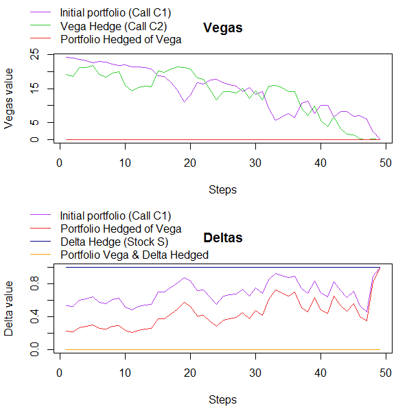
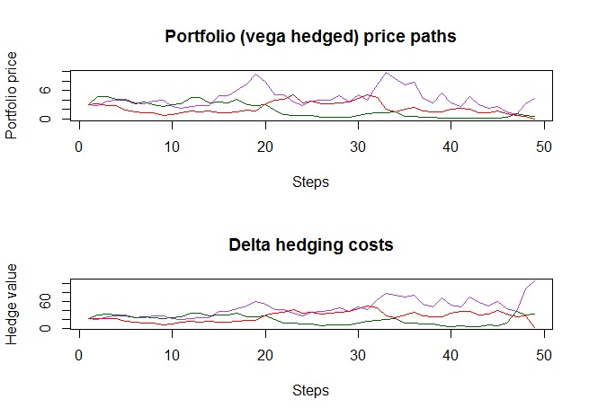

[](http://quantlet.de/)

## [](http://quantlet.de/) **SFEDeltaVegaHedging** [](http://quantlet.de/)

```yaml

Name of Quantlet : SFEDeltaVegaHedging

Published in : Statistics of Financial Markets I

Description : Constructing a vega-delta-neutral portfolio

Keywords : vega, delta, hedging, neutral portfolio, simulation, hedging cost

Author : Victor Cluzel, Florian Reichert

Submitted : Wed, November 30 2016

Output : Graphs of hedging costs and vega dependency on stock price and time to maturity

```






### R Code:
```r
rm(list = ls(all = TRUE))
graphics.off()

# Declare variables
n   = 50        # periods (steps)
S0  = 98        # initial stock price
sig = 0.2       # volatility
r   = 0.05      # risk-free interest rate
K1  = 100       # exercise price for call 1
K2  = 110       # exercise price for call 2
t0  = 6/52      # current time (1 week = 1/52)
mat = 26/52     # maturity

# Function for price of the call
black_scholes_call = function(S, K, Tau, r, sigma) {
                 y = (log(S/K) + (r - sigma^2/2) * Tau)/(sigma * sqrt(Tau))
                 v = S * pnorm(y + sigma * sqrt(Tau)) - exp(-r * Tau)* K * pnorm(y)
                     return(v)
}

# Function for vega
black_scholes_vega = function(S, K, Tau, r, sigma) {
                 y = (log(S/K) + (r - sigma^2/2) * Tau)/(sigma * sqrt(Tau))
                 v = S * sqrt(Tau)*dnorm(y + sigma * sqrt(Tau))
                     return(v)
}

# Function for delta
black_scholes_delta = function(S, K, Tau, r, sigma) {
              y     = (log(S/K) + (r - sigma^2/2) * Tau)/(sigma * sqrt(Tau))
              v     = pnorm(y + sigma * sqrt(Tau))
                      return(v)
}

# Vega and delta hedging

GeneratePaths_vegadelta = function(S0, sig, maturity, K1, K2, r, n, t0) {
  dt 	= (maturity - t0)/n             # period between steps n 
  t 	= seq(t0, maturity, l = n)      # maturity - t0 divided in n intervals
  tau = maturity - t                  # time to maturity
  
  # Simulate the stock price path
  Wt 	= c(0, sqrt(dt) * cumsum(rnorm(n - 1, 0, 1)))
  S 	= S0 * exp((r - 0.5 * sig^2) * t + sig * Wt)
  
  # Compute vegas and the associated hedging costs
  C1              = black_scholes_call(S, K1, tau, r, sig)
  C2              = black_scholes_call(S, K2, tau, r, sig)
  vega1           = black_scholes_vega(S, K1, tau, r, sig)
  vega2           = black_scholes_vega(S, K2, tau, r, sig)
  
  hedge_costs_vega    = c(-vega1[1]/vega2[1] * C2[1], -(vega1[2:n]/vega2[2:n]) * C2[2:(n)])
  ptf_hedged_vega     = C1 + hedge_costs_vega
  vega3               = vega1 + (hedge_costs_vega/C2) * vega2
  
  #Compute delta of hedged portfolio and hedging costs
  delta0                   = black_scholes_delta(S, K1, tau, r, sig)
  delta                    = black_scholes_delta(S, K1, tau, r, sig) + (hedge_costs_vega/C2) * black_scholes_delta(S, K2, tau, r, sig)
  hedge_qtty_delta         = c(delta[1], delta[2:n] - delta[1:(n - 1)])
  hedge_costs_delta        = c(delta[1] * S[1], (delta[2:n] - delta[1:(n - 1)]) * S[2:n])
  cum_hedge_qtty_delta     = cumsum(hedge_qtty_delta)
  cum_hedge_costs_delta    = cumsum(hedge_costs_delta)
  
  ptf_hedged_total  = C1 + hedge_costs_vega - cum_hedge_costs_delta
  delta_S           = seq(1, 1, l = 50)
  delta_tot         = delta - cum_hedge_qtty_delta
  
  # Result
  result = data.frame(ptf_hedged_vega = ptf_hedged_vega[1:(n-1)], CumCosts = cum_hedge_costs_delta[1:(n-1)],
                      vega1 = vega1[1:(n-1)], vega2 = vega2[1:(n-1)], vega3 = vega3[1:(n-1)], delta0 = delta0[1:(n-1)],
                      delta = delta[1:(n-1)], delta_S = delta_S[1:(n-1)], delta_tot = delta_tot[1:(n-1)])
                      return(result)
}

# Run simulation of the result
sim = cbind(GeneratePaths_vegadelta(S0 = S0, sig = sig, maturity = mat, K1 = K1, K2 = K2, r = r, n = n, 
            t0 = t0), GeneratePaths_vegadelta(S0 = S0, sig = sig, maturity = mat, K1 = K1, K2 = K2, r = r, n = n, 
            t0 = t0), GeneratePaths_vegadelta(S0 = S0, sig = sig, maturity = mat, K1 = K1, K2 = K2, r = r, n = n, 
            t0 = t0))

# Plot the Option prices
split.screen(c(2, 1))
screen(1)
plot(x = 1:nrow(sim), y = sim[, 1], main = "Portfolio (vega hedged) price paths", xlab = "Steps", ylab = "Portfolio price", 
     ylim = c(min(sim[, 1], sim[, 10], sim[, 19]), max(sim[, 1], sim[, 10], sim[, 19])), 
     type = "l", col = "darkorchid2")
lines(x = 1:nrow(sim), y = sim[, 10], col = "darkgreen")
lines(x = 1:nrow(sim), y = sim[, 19], col = "red")

# Plot the Costs of hedge
screen(2)
plot(x = 1:nrow(sim), y = sim[, 2], main = "Delta hedging costs", xlab = "Steps", ylab = "Hedge value", 
     ylim = c(min(sim[, 2], sim[, 11], sim[, 20]), max(sim[, 2], sim[, 11], sim[, 20])), 
     type = "l", col = "darkorchid2")
lines(x = 1:nrow(sim), y = sim[, 11], col = "darkgreen")
lines(x = 1:nrow(sim), y = sim[, 20], col = "red")

# Plot the vegas
dev.new()
split.screen(c(2, 1))
screen(1)
plot(x = 1:nrow(sim), y = sim[, 3], main = "Vegas", xlab = "Steps", ylab = "Vegas value", 
     ylim = c(min(sim[, 3], sim[, 4], sim[, 5]), max(sim[, 3], sim[, 4], sim[, 5])), 
     type = "l", col = "darkorchid2")
lines(x = 1:nrow(sim), y = sim[, 4], col = "limegreen")
lines(x = 1:nrow(sim), y = sim[, 5], col = "firebrick2")
par(xpd=TRUE)
legend(x=-6, y = 41.5, legend=c("Initial portfolio (Call C1)", "Vega Hedge (Call C2)", "Portfolio Hedged of Vega"),
       lty=1, lwd=1, col=c("darkorchid2", "limegreen", "firebrick2"),bty = "n")


# Plot the deltas
screen(2)
plot(x = 1:nrow(sim), y = sim[, 6], main = "Deltas", xlab = "Steps", ylab = "Delta value", 
     ylim = c(min(sim[, 6], sim[, 7], sim[, 8], sim[, 9]), max(sim[, 6], sim[, 7], sim[, 8], sim[, 9])), 
     type = "l", col = "darkorchid2")
lines(x = 1:nrow(sim), y = sim[, 7], col = "firebrick2")
lines(x = 1:nrow(sim), y = sim[, 8], col = "darkblue")
lines(x = 1:nrow(sim), y = sim[, 9], col = "orange")
par(xpd=TRUE)
legend(x=-6, y = 1.8, legend=c("Initial portfolio (Call C1)", "Portfolio Hedged of Vega", "Delta Hedge (Stock S)", "Portfolio Vega & Delta Hedged"),
       lty=1, lwd=1, col=c("darkorchid2", "firebrick2", "darkblue","orange"), bty = "n")


```
