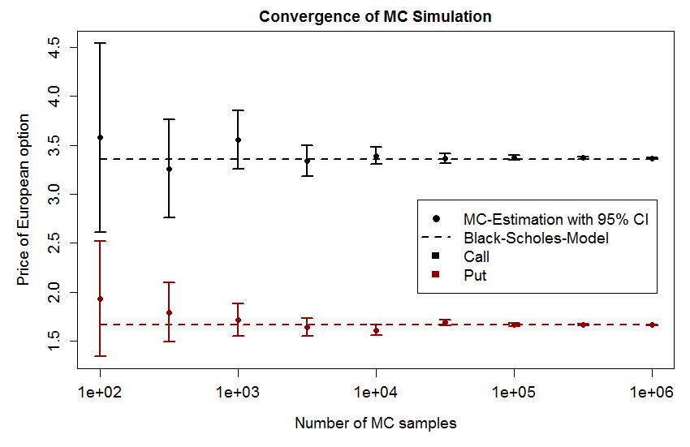

[](http://quantlet.de/)

## [](http://quantlet.de/) **SFEMCEuropConv** [](http://quantlet.de/)

```yaml


Name of Quantlet: SFEMCEuropConv

Published in:     Statistics of Financial Markets I

Description:     'Calculates the price and 95% confidence intervall of European 
                  options using Monte Carlo Simulation for several numbers of MC 
                  samples and visualizes the convergence of the MC estimate to 
                  the true value.' 

Keywords:        'european-option, option-price, monte-carlo, simulation, option, 
                  call, put, black-scholes'

Author:           Stefan Ritschel

See also:         SFEAsianCallPayoffVis, SFEMCAsianCallVsEuropCall, SFEMCAsian, SFEMCEurop

Submitted:        2016/12/16


Input: 
- s.0:   current stock price
- k:     strike price
- tau:   time to maturity in years
- r:     annual interest rate
- sigma: volatility

Output:  Plot of European option prize as function of number of MC samples


```



### R Code
```r

# clear variables and close windows
rm(list = ls(all = TRUE))
graphics.off()

# settings
s.0   = 40    # current stock price
k     = 39    # strike price
tau   = 0.6   # time to maturity in years
r     = 0.03  # annual interest rate
sigma = 0.2   # volatility

# function for simulating stock price by geometric brownian motion
MCPath = function(s.0, tau, n.t, r, sigma, n.mc) {
    dt = tau/n.t
    t = seq(0, tau, by = dt)
    s.t = s.0 * exp((r - sigma^2/2) * t) * 
                exp(replicate(n.mc, c(0, cumsum(sigma * sqrt(dt) * rnorm(n.t)))))
    return(s.t)
}

# function for calculating MC estimate and confidence intervall of european option price
MCEurop = function(s.0, k, tau, n.t, r, sigma, n.mc) {
    
    s.t = MCPath(s.0, tau, n.t, r, sigma, n.mc)
    
    # payoff
    c = matrix(pmax(0, s.t[nrow(s.t), ] - k), 1, ncol(s.t))  # call
    p = matrix(pmax(0, k - s.t[nrow(s.t), ]), 1, ncol(s.t))  # put
    v = exp(-r * tau) * rbind(c, p)                          # discounted
    
    # MC estimate
    v.mc = rowSums(v)/ncol(s.t)
    
    # 95% confidence intervall for MC-estimate
    conf95 = 1.96 * 1/sqrt(ncol(s.t)) * sqrt(1/(ncol(s.t) - 1) * rowSums((v - v.mc)^2))
    
    return(cbind(v.mc, conf95))
}

# function for calculating the Black-Scholes price of European option
BSEurop = function(s0, k, tau, r, sigma) {
    d1 = (log(s0/k) + (r + (sigma^2/2)) * tau)/(sigma * sqrt(tau))
    d2 = d1 - (sigma * sqrt(tau))
    c  = s0 * pnorm(d1) - k * exp(-r * tau) * pnorm(d2)     # call
    p  = -s0 * pnorm(-d1) + k * exp(-r * tau) * pnorm(-d2)  # put
    return(c(c, p))
}

# main

j      = seq(2, 6, 0.5)
n.mc   = 10^j
v.call = matrix(0, length(n.mc), 2)
v.put  = matrix(0, length(n.mc), 2)

# calculate MC prices for several n.mc
for (i in 1:length(n.mc)) {
    
    mc = MCEurop(s.0, k, tau, n.t = 1, r, sigma, n.mc = n.mc[i])
    
    # MC estimate
    v.call[i, 1] = mc[1, 1]
    v.put[i, 1]  = mc[2, 1]
    
    # 95% confidence
    v.call[i, 2] = mc[1, 2]
    v.put[i, 2]  = mc[2, 2]
}

# calculate Black-Scholes prices
bs = BSEurop(s.0, k, tau, r, sigma)

# plotting

# up = value + 95%CI, dw = value - 95%CI
v.call.up = v.call[, 1] + v.call[, 2]
v.call.dw = v.call[, 1] - v.call[, 2]
v.put.up  = v.put[, 1] + v.put[, 2]
v.put.dw  = v.put[, 1] - v.put[, 2]

# y-axis limit for plot
ylimit = c(min(v.call.dw, v.put.dw), max(v.call.up, v.put.up))

par(mar = c(5, 5, 2, 1))

# plot MC values
plot(n.mc, v.call[, 1], 
     log     = "x", type = "p", pch = 16, ylim = ylimit, col = "black",
     main    = "Convergence of MC Simulation",
     ylab    = "Price of European option", 
     xlab    = "Number of MC samples", 
     cex.lab = 1.2, cex.axis = 1.2, cex.main = 1.2, cex.sub = 1.2)
lines(n.mc, v.put[, 1], type = "p", pch = 16, col = "darkred")

# plot Black-Scholes values
lines(n.mc, matrix(bs[1], length(n.mc), 1)[, 1], 
      type = "l", lty = 2, lwd = 2, col = "black")
lines(n.mc, matrix(bs[2], length(n.mc), 1)[, 1], 
      type = "l", lty = 2, lwd = 2, col = "darkred")

# plot errorbars
arrows(n.mc, v.call.dw, n.mc, v.call.up, 
       code = 3, angle = 90, length = 0.1, lwd = 2, col = "black")
arrows(n.mc, v.put.dw, n.mc, v.put.up, 
       code = 3, angle = 90, length = 0.1, lwd = 2, col = "darkred")

# plot legend
legend(2*10^4, max(bs[1], bs[2]) - 0.25 * min(bs[1], bs[2]), 
       legend = c("MC-Estimation with 95% CI", "Black-Scholes-Model", "Call", "Put"), 
       lwd = 2, lty = c(0, 2, 0, 0), pch = c(16, NA, 15, 15), cex = 1.2, 
       col = c("black", "black", "black", "darkred"))


```

automatically created on 2018-05-28