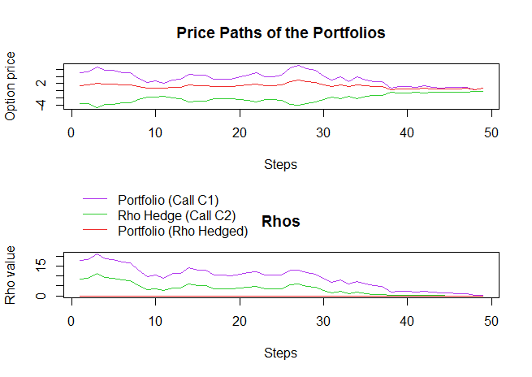
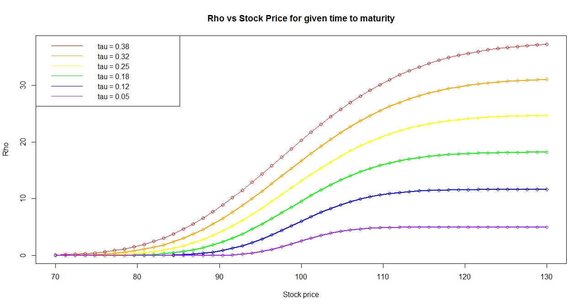

[](http://quantlet.de/)

## [](http://quantlet.de/) **SFERhoHedging** [](http://quantlet.de/)

```yaml

Name of Quantlet : SFERhoHedging

Published in : Statistics of Financial Markets I

Description : Constructing a rho-neutral portfolio

Keywords : rho, hedging, neutral portfolio, simulation, hedging cost

Author : Victor Cluzel, Florian Reichert

Submitted : Wed, November 30 2016

Output : Graphs of hedging costs and rho dependency on stock price and time to maturity

```






### R Code:
```r
rm(list = ls(all = TRUE))
graphics.off()

# Declare variables
n   = 50        # periods (steps)
S0  = 98        # initial stock price
sig = 0.2       # volatility
r   = 0.05      # risk-free interest rate
K1  = 100       # exercise price of call C1
K2  = 110       # exercise price of call C2
t0  = 6/52      # current time (1 week = 1/52)
mat = 26/52     # maturity


# Function for price of the call
black_scholes_call = function(S, K, Tau, r, sigma) {
                 y = (log(S/K) + (r - sigma^2/2) * Tau)/(sigma * sqrt(Tau))
                 v = S * pnorm(y + sigma * sqrt(Tau)) - exp(-r * Tau) * K * pnorm(y)
                     return(v)
}

# Function for rho
black_scholes_rho = function(S, K, Tau, r, sigma) {
              y   = (log(S/K) + (r - sigma^2/2) * Tau)/(sigma * sqrt(Tau))
              rho = K * Tau * exp(-r * Tau) * pnorm(y)
                    return(rho)
}

# Vega and delta hedging
GeneratePaths = function(S0, sig, maturity, K1, K2, r, n, t0) {
          dt 	= (maturity - t0)/n             # period between steps n 
          t 	= seq(t0, maturity, l = n)      # maturity - t0 divided in n intervals
          tau = maturity - t                  # time to maturity
  
  # Simulate the stock price path
  Wt 	= c(0, sqrt(dt) * cumsum(rnorm(n - 1, 0, 1)))
  S 	= S0 * exp((r - 0.5 * sig^2) * t + sig * Wt)


  # Compute rhos and the associated hedging costs
  C1              = black_scholes_call(S, K1, tau, r, sig)
  C2              = black_scholes_call(S, K2, tau, r, sig)
  rho1            = black_scholes_rho(S, K1, tau, r, sig)
  rho2            = black_scholes_rho(S, K2, tau, r, sig)
  rho_hedge_costs = c(-rho1[1]/rho2[1] * C2[1], -(rho1[2:n]/rho2[2:n]) * C2[2:(n)])
  rho_ptf_hedged  = C1 + rho_hedge_costs
  rho3            = rho1 + (rho_hedge_costs / C2) * rho2 

# Result
result = data.frame(C1 = C1[1:(n-1)], CumCosts = rho_hedge_costs[1:(n-1)], ptf_hedged = rho_ptf_hedged[1:(n-1)],
                    rho1 = rho1[1:(n-1)], rho2 = rho2[1:(n-1)], rho3 = rho3[1:(n-1)])
                    return(result)
}

# Run simulation of the result
sim = GeneratePaths(S0 = S0, sig = sig, maturity = mat, K1 = K1, K2 = K2, r = r, n = n, 
                    t0 = t0)

# Plot the Option prices
split.screen(c(2, 1))
screen(1)
plot(x = 1:nrow(sim), y = sim[, 1], main = "Price Paths of the Portfolios", xlab = "Steps", ylab = "Option price", 
     ylim = c(min(sim[, 1], sim[, 2], sim[, 3]), max(sim[, 1], sim[, 2], sim[, 3])), 
     type = "l", col = "darkorchid2")
lines(x = 1:nrow(sim), y = sim[, 2], col = "limegreen")
lines(x = 1:nrow(sim), y = sim[, 3], col = "firebrick2")

# Plot the rhos
screen(2)
plot(x = 1:nrow(sim), y = sim[, 4], main = "Rhos", xlab = "Steps", ylab = "Rho value", 
     ylim = c(min(sim[, 4], sim[, 5], sim[, 6]), max(sim[, 4], sim[, 5], sim[, 6])), 
     type = "l", col = "darkorchid2")
lines(x = 1:nrow(sim), y = sim[, 5], col = "limegreen")
lines(x = 1:nrow(sim), y = sim[, 6], col = "firebrick2")
par(xpd= TRUE)
legend(x=0,y =max(sim[, 4], sim[, 5], sim[, 6])*2+15, legend=c("Portfolio (Call C1)", "Rho Hedge (Call C2)", "Portfolio (Rho Hedged)"),
       lty=1, lwd=1, col=c("darkorchid2", "limegreen", "firebrick2"),bty = "n")


# Plot rho vs sigma for different time to maturities
# parameter settings
Smin   = 70         # lower bound of stock price
Smax   = 130        # upper bound of stock price
taumin = 0.05       # lower bound of time to maturity
taumax = 20/52      # upper bound of time to maturity
S0     = 98         # initial stock pricet
K      = 100        # strike price
r      = 0.05       # interest rate
sigma  = 0.2        # volatility
steps  = 50
tsteps = 5
T      = 26/52
St     = seq(Smax, Smin, by = -(Smax - Smin)/(steps))
taus   = seq(taumax, taumin, by = -(taumax - taumin)/tsteps)  # different time to maturity
rho    = matrix(0, (steps + 1), length(taus))


# Calculation of rho for the different Stock price at constant time to maturity
for (i in 1:length(taus)) {
  rho[, i] = black_scholes_rho(St, K, taus[i], r, sigma)
}
dev.new()
plot(St, rho[, 1], col = "red", xlab = "Stock price", ylab = "Rho", main = "Rho vs Stock Price for given time to maturity")
lines(St, rho[, 1], col = "red")

points(St, rho[, 2], col = "orange")
points(St, rho[, 3], col = "yellow")
points(St, rho[, 4], col = "green")
points(St, rho[, 5], col = "blue")
points(St, rho[, 6], col = "purple")

lines(St, rho[, 2], col = "orange", lwd = 2)
lines(St, rho[, 3], col = "yellow", lwd = 2)
lines(St, rho[, 4], col = "green", lwd = 2)
lines(St, rho[, 5], col = "blue", lwd = 2)
lines(St, rho[, 6], col = "purple", lwd = 2)

legend("topleft", c(paste("tau =", round(taus[1:6], digits = 2))), col = c("red","orange", "yellow", "green", "blue", "purple"), lty = 1) 

```
