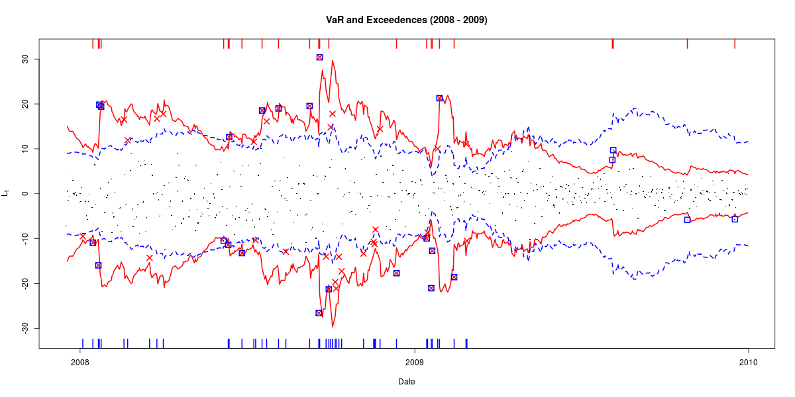
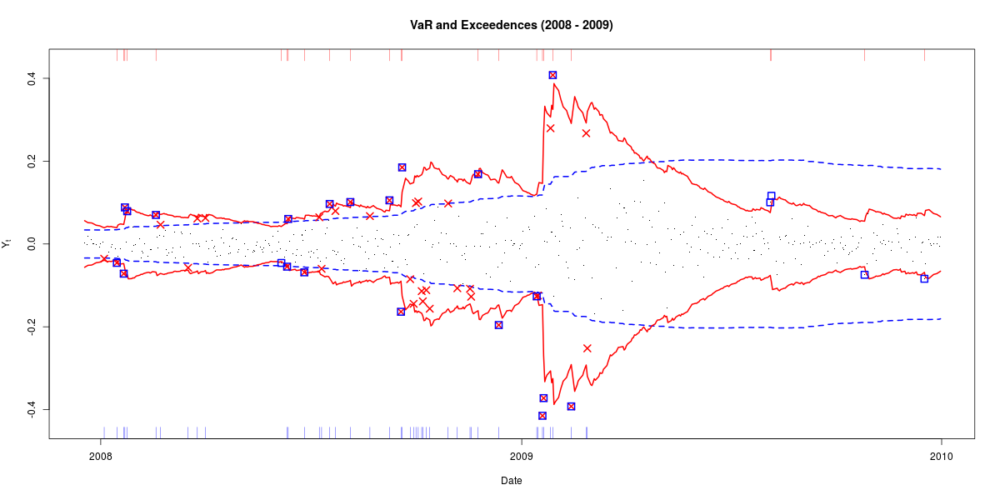

[](http://quantlet.de/)

## [](http://quantlet.de/) **SFEVaRtimeplot** [](http://quantlet.de/)

```yaml


Name of Quantlet : SFEVaRtimeplot

Published in : Statistics of Financial Markets I

Description : 'Calculates the RMA and EMA of a portfolio of assets'

Keywords : VaR, data visualization, risk, portfolio, RMA, EMA, estimation, exceedance, financial, forecast, normal-distribution, time-series

Author : Marta Domagalska, Xiang Gao, Pegah Maham, David Pollack

Submitted : 2016/12/12

Input: 
- h: Time horizon for RMA and EMA
- alpha: Confidence-level of RMA and EMA
- gamma: decay of EMA

Datafile:
- SFEVaRbank.csv : 'Time-series of the nominal prices of the DAX30, FTSE 100, and an 
assortment of stocks of other large companies.  Originally this file was named 
"2004-2014_dax_ftse". (daily periodicity from 05/04 - 05/14)'

Example: 'A combined plot containing the following: the log returns of a portfolio 
as points, the VaR using the RMA and EMA methods as lines, and the exceedences of 
RMA and EMA as rugs. (01/2007 - 01/2009)'


```





### R Code
```r

# clear variables and close windows
rm(list = ls(all = TRUE))
graphics.off()

# install and load packages
libraries = c("dplyr", "lubridate", "quantmod")
lapply(libraries, function(x) if (!(x %in% installed.packages())) {install.packages(x)})
lapply(libraries, library, quietly = TRUE, character.only = TRUE)

# Inputs
h     = 250
alpha = 0.01
gamma = 0.94

# Load Data
data = read.csv("SFEVaRbank.csv")

# Functions
calcRMA = function(serie, h = 250){
  # find the first non NA position
  s = rle(is.na(serie))$length[1]
  # Calculate the RMA of the serie for with the parameter h
  rma = sapply((s + h + 1): length(serie), FUN = function(n) {
    sum(serie[(n - h): (n - 1)] * serie[(n - h): (n - 1)], na.rm = T) / (h - 1)})
  rma = c(rep(NA, s + h), rma)
  return(rma)
}

emaWeight = function(h, gamma){
  weight = gamma^(h: 1) * (1 - gamma)
  return(weight)
}

calcEMA = function(serie, gamma = 0.94, h = 250){
  s      = rle(is.na(serie))$length[1]
  weight = emaWeight(h, gamma)
  # ema calculation
  ema = sapply((s + h + 1): length(serie), FUN = function(n) {
    sum(serie[(n - h): (n - 1)] * serie[(n - h): (n - 1)] * weight, na.rm = T)})
  ema = c(rep(NA, s + h), ema)
  return(ema)
}

# Colors
pcolors = data.frame(rma = "blue", ema = "red", stringsAsFactors=FALSE)

# Choose the Stocks
# which(colnames(data) == "LLOYDS.BANKING.GROUP") == 34
Stocks = data[year(data$Date) %in% c(2007, 2008, 2009), c(1, 34)]

# Build portfolio of log-returns
Portfolio = data.frame(Date       = as.Date(Stocks$Date), 
                       Price      = (Stocks[, 2]),
                       PercChange = c(NA,diff(log(Stocks[, 2]))),
                       AbsChange  = c(NA,diff(Stocks[, 2])))

# calculate t-value
tCrit = qnorm(1 - alpha) 
# calculate VaR
Portfolio$VaRRMAY = calcRMA(Portfolio$PercChange, h = h) ^ 0.5 * tCrit
Portfolio$VaREMAY = calcEMA(Portfolio$PercChange, gamma = gamma, h = h) ^ 0.5 * tCrit
Portfolio$VaRRMAL = Portfolio$VaRRMAY * Portfolio$Price
Portfolio$VaREMAL = Portfolio$VaREMAY * Portfolio$Price
# calculate exceedences
Portfolio$RugsRMAL = (Portfolio$AbsChange > Portfolio$VaRRMAL | 
                        Portfolio$AbsChange < -Portfolio$VaRRMAL)
Portfolio$RugsEMAL = (Portfolio$AbsChange > Portfolio$VaREMAL | 
                        Portfolio$AbsChange < -Portfolio$VaREMAL)
Portfolio$RugsRMAY = (Portfolio$PercChange > Portfolio$VaRRMAY | 
                        Portfolio$PercChange < -Portfolio$VaRRMAY)
Portfolio$RugsEMAY = (Portfolio$PercChange > Portfolio$VaREMAY | 
                        Portfolio$PercChange < -Portfolio$VaREMAY)
# remove rows without VaR
Portfolio = Portfolio[- c(1 :h), ]

# Plot Result for Lt/AbsChange
ymax = 1.05 * max(abs(min(Portfolio$AbsChange)), abs(max(Portfolio$AbsChange)))
plot(Portfolio$Date, Portfolio$AbsChange, pch = 16, cex = 0.3, ylim = c(-ymax, ymax), 
     ylab = expression({L}[t]), xlab = "Date", main = "VaR and Exceedences (2008 - 2009)")
lines(Portfolio$Date, Portfolio$VaRRMAL, col = pcolors$rma, lty = 2, lwd = 2)
lines(Portfolio$Date, - Portfolio$VaRRMAL, col = pcolors$rma, lty = 2, lwd = 2)
lines(Portfolio$Date, Portfolio$VaREMAL, col = pcolors$ema, lwd = 2)
lines(Portfolio$Date, - Portfolio$VaREMAL, col = pcolors$ema, lwd = 2)

# Add Rugs, for Rma at the bottom, for Ema at the top
rug(Portfolio$Date[Portfolio$RugsRMAL], side = 1, col = pcolors$rma, lwd = 2)
rug(Portfolio$Date[Portfolio$RugsEMAL], side = 3, col = pcolors$ema, lwd = 2)
points(Portfolio$Date[Portfolio$RugsRMAL], Portfolio$AbsChange[Portfolio$RugsRMAL], 
       col = "red", pch = 4, lwd = 2, cex = 1.5)
points(Portfolio$Date[Portfolio$RugsEMAL], Portfolio$AbsChange[Portfolio$RugsEMAL], 
       col = "blue", pch = 0, lwd = 2, cex = 1.5)
dev.print(device = png, filename = 'VaR_LtAbsChange.png', width = 1200, height = 600)
# dev.off()

# Plot Result for Yt/PercChange
ymax = 1.05 * max(abs(min(Portfolio$PercChange)), abs(max(Portfolio$PercChange)))
plot(Portfolio$Date, Portfolio$PercChange, pch = 16, cex = 0.2, ylim = c(-ymax, ymax), 
     ylab = expression({Y}[t]), xlab = "Date", main = "VaR and Exceedences (2008 - 2009)")
lines(Portfolio$Date, Portfolio$VaRRMAY, col = pcolors$rma, lty = 2, lwd = 2)
lines(Portfolio$Date, - Portfolio$VaRRMAY, col = pcolors$rma, lty = 2, lwd = 2)
lines(Portfolio$Date, Portfolio$VaREMAY, col = pcolors$ema, lwd = 2)
lines(Portfolio$Date, - Portfolio$VaREMAY, col = pcolors$ema, lwd = 2)

# Add Rugs, for Rma at the bottom, for Ema at the top
Portfolio$RugsRMAY = (Portfolio$PercChange > Portfolio$VaRRMAY | 
                        Portfolio$PercChange < -Portfolio$VaRRMAY)
Portfolio$RugsEMAY = (Portfolio$PercChange > Portfolio$VaREMAY | 
                        Portfolio$PercChange < -Portfolio$VaREMAY)
# plot rug
rug(Portfolio$Date[Portfolio$RugsRMAY], side = 1, col = pcolors$rma)
rug(Portfolio$Date[Portfolio$RugsEMAY], side = 3, col = pcolors$ema)
# plot exceedences
points(Portfolio$Date[Portfolio$RugsRMAY], Portfolio$PercChange[Portfolio$RugsRMAY], 
       col = "red", pch = 4, lwd = 2, cex = 1.5)
points(Portfolio$Date[Portfolio$RugsEMAY], Portfolio$PercChange[Portfolio$RugsEMAY], 
       col = "blue", pch = 0, lwd = 2, cex = 1.5)
dev.print(device = png, filename = 'VaR_YtPercChange.png', width = 1200, height = 600)
# dev.off()

```

automatically created on 2018-05-28